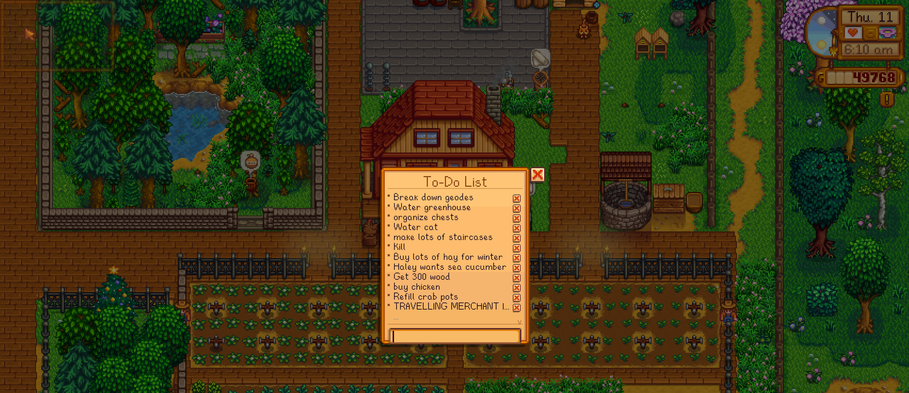

# Minimalistic Todo List

Life in Stardew Valley can get hectic. Sometimes, you need a convenient place to keep track of what you need to do. Behold, the **Minimalistic Todo List** mod is a Stardew Valley mod using SMAPI. It allows you to open a menu at any time where you can quickly add/remove tasks that you may need to get done during your stay in Stardew Valley. These tasks are saved at the end of each day.

## Requirements
- [Latest version of SMAPI](https://smapi.io/) (This mod was developed and tested with [SMAPI 4.3.2](https://github.com/Pathoschild/SMAPI/releases/tag/4.3.2). Other nearby SMAPI versions may work, but have not been extensively tested.)

## How to use
Its a very simple mod!
- Open the menu using the `L` Key!
    - Unfortunately, I'm not sure how to allow the user to change this keybind in case it interferes with another mod. I believe this can be done using the [Generic Mod Config Menu (GMCM)](https://www.nexusmods.com/stardewvalley/mods/5098) mod. Perhaps in a future update, I will integrate this mod with `GMCM`.

## Features
- Conveniently open up the menu by pressing the `L` Key
- Add a task easily! Just type a line of text and the mod will add it to the list as a bullet point
- Remove a task by pressing the `X` button accompanying each task.
- Too many tasks? You can add as many tasks as you want and scroll through them.
- Your todo list is saved at the end of each day.
- Todo list is unique per-save meaning that each todo list you make will be unique to that farm.

## Limitations
Its important to know what you will get out of this mod:
- Todo list entries have a character limit of 27 characters. Unfortunately, I did not want to handle text overflow and all the other *fancy* features of a text editor :\(
- Adding on to that, this also means that entries will never span multiple lines. If text is too long, the end of the task will just be replaced with an ellipsis.
- As of this moment, you cannot change the keybind to open up the todo list.
- You cannot set due dates, or view other meta information. Its straight up just text on a box.

This project is under the MIT License. The [source code](https://github.com/Jumony/TodoListMod-StardewValley) for this mod is also publicly available because I'd like others to create an even better todo list mod. Maybe they can use my code as an example.

## Final Words
I'm not sure if I'll continue updating this mod. Maybe if it gets enough traction but this was mostly a mod made for myself so if I get bored of Stardew Valley, this mod will likely no longer be supported until I get back in the Stardew Valley mood again.

Source code is available though! If something happens, I've laid out the foundation for you!

Mod Author: Jumony